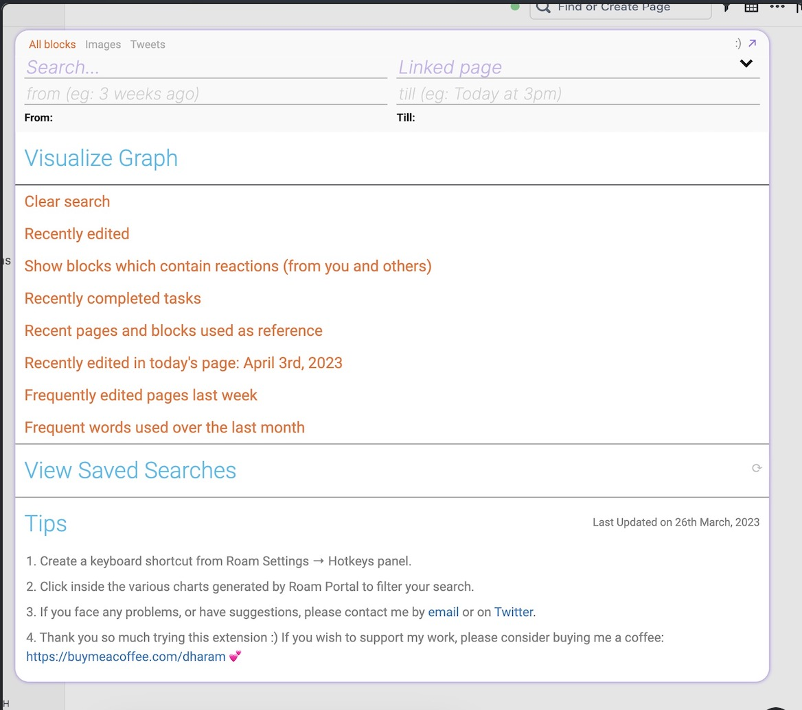

# Roam Portal

Roam Portal is a search engine designed to help you explore your data visually.

## Getting Started

To start using this extension, simply click on the Roam Portal icon located in the top right corner of the toolbar.

## Features

With Roam Portal, you can take advantage of the following features:

- **Filter blocks by user:** Filter blocks modified by a particular user.
- **View recently edited blocks:** View your recently edited blocks.
- **Search within block results:** Search within all of your block results and embeds.
- **Search for images:** Search for images in your graph.
- **Search for reactions:** Search for reactions from users.
- **3D/2D view of your Roam Graph:** Get a 3D/2D view of your Roam Graph.
- **3D globe view:** Get a 3D globe view that shows cities, countries, and other locations mentioned in your graph.
- **Search and visualize tweets:** Search for and visualize tweets from your graph.
- **Tweet individual blocks:** Tweet individual blocks from Roam.
- **Sort search results by date:** View search results sorted by date.
- **Filter search results by date/page:** Filter search results by date or page.
- **Visualize usage over time:** Visualize and compare usage of your page and block references over time.
- **Explore attributes:** Explore attributes of your Roam Graph.
- **Search using regular expressions:** Search by using regular expressions.
- **Visualize frequency:** Visualize frequencies of similar pages and words.
- **Create saved searches:** Create saved searches for easy access.
- **Search for exact phrases/matches:** Search for only exact phrases or matches with similar spellings.
- **Filter out code blocks:** Filter out code blocks in your search.

... and more features to come!

## How to Use

### Search fields

__At the top you'll see four search fields. Only one of these needs to be filled to do a search.__

- **Search**: Enter a word or a phrase. The search returns blocks containing these strings.
- **Linked Page**: Enter a page. The search results will filter out blocks which are inside that page, or parent/children blocks wherever this page is mentioned in the Roam graph.
- **From**: Enter a date. The search returns blocks edited **after** this date.
- **Till**:  Enter a date. The search returns blocks edited **before** this date.

**Note about the date fields** you can write using natural language, like "3 months ago" or "Yesterday at 9am", as well as numbers, like "2020-10-08"

### Tabs

- **Home**: View saved searches and tips
- **Results**: List of pages and blocks sorted by last edited
- **Graph**: Visualize your search in 2D/3D graphs
- **Globe**: Explore locations mentioned in your graph on a 3D globe
- **Time**: Analyze results over time
- **References**: Study frequent pages and blocks mentioned in your search
- **Pages**: Examine results by the most frequent 25 pages
- **Words**: Investigate results based on the most frequent 25 words related to the search

### Advanced options

- Search inside a specific page
- Find mentions of a particular page
- Locate blocks containing specific block references
- Include all references and embeds of your search term
- Search with similar spellings
- Include or exclude code blocks in results
- Match the exact phrase
- Enable regular expression searches

## Contact

If you face any issues, or have questions, reach out to me on [Twitter](https://twitter.com/dharamkapila), or by creating an issue on Github.
